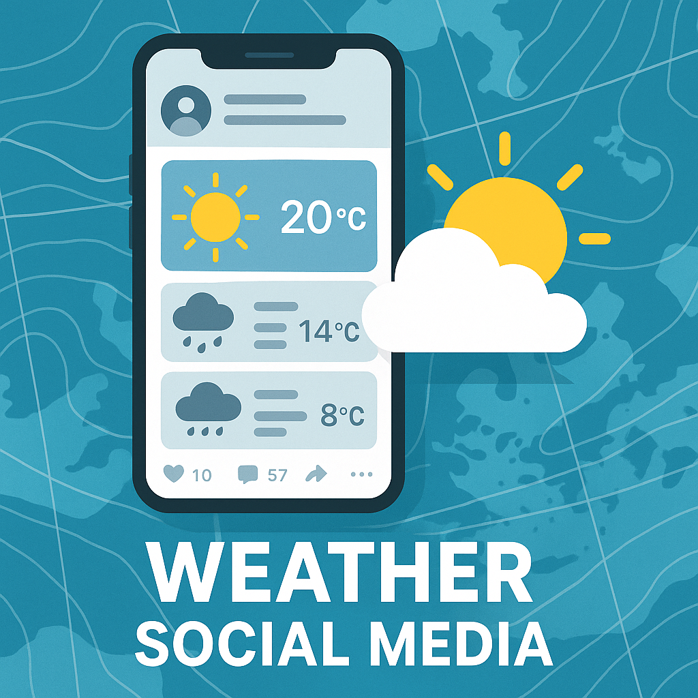

# Weather Social Media App

A **Flutter-based** mobile application that combines **real-time weather data** with engaging **social media features**. Users can share weather posts, interact with others through likes, comments, and follow systems, and manage their profiles securely with two-factor authentication.

## Features

- **City-based Feed** – View weather posts filtered by your current city or others.
- **Live Weather Data** – Fetched via a public weather API for accurate conditions.
- **Image Posts** – Upload photos with weather captions and share them in the feed.
- **Like System** – Like posts and individual comments.
- **Comment System** – Add and view comments on any post.
- **Two-Factor Authentication** – Change email or password securely via verified email.
- **Follow Users** – Connect with others and explore their weather stories.
- **Tabbed Navigation** – Easily switch between weather screen, post creation, feed, and profile.
- **Cloud Storage** – Firebase Storage for uploaded images.
- **Cloud Firestore** – For storing posts, users, comments, and interactions.
- **User Profiles** – View, edit, and manage your personal posts.
- **Direct Messaging** – Real-time chats between users.
  
## Tech Stack

- **Flutter** & **Dart**
- **Firebase Authentication**
- **Firebase Firestore**
- **Firebase Storage**
- **Firebase Email Verification**
- **Weather API (OpenWeatherMap)**
- **State Management**: Provider

## Demo Video

## Getting Started

### 1. Clone the repository

bash:
git clone https://github.com/Rohan-Waseem/Flutter-weather-social-media.git

Replace your lib folder with the lib folder in cloned project.

### 2. Install dependencies

[dependencies](./assets/1.png)

flutter pub get

### 3. Firebase Setup

### 4. Run the app

flutter run

## Security Features

-**Email verification on signup**  
-**Two-factor authentication for:**  
-**Email change**  
-**Password reset**  
-**Only verified users can post or comment**  

## License
Licensed under the GNU GPLv3 License  
You may freely use, modify, and distribute the code under the same license terms.  

## Developer
Rohan Waseem  
rohan.waseem965@gmail.com.  
https://www.linkedin.com/in/rohan-w-53124731b.  

Made with using Flutter & Firebase
